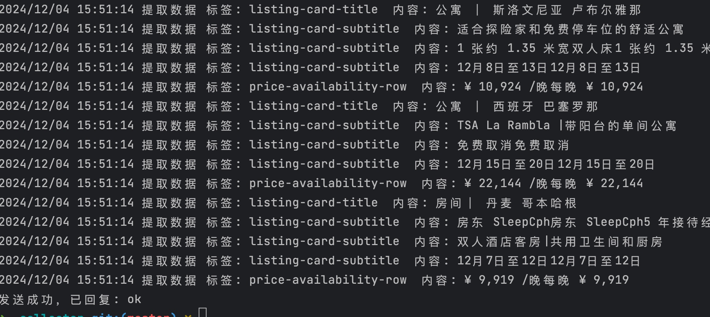
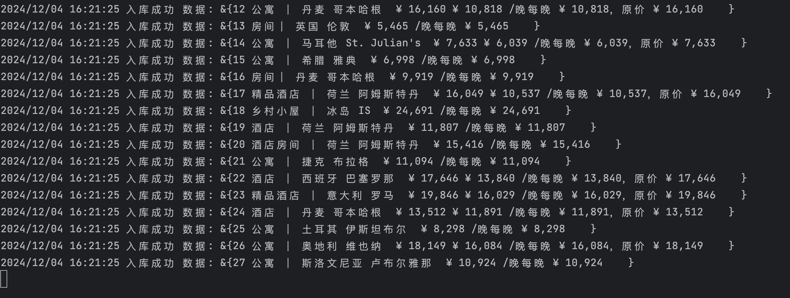

# 爬虫
## 文档
#### 参数
mode = 1 消费入库 、 2 爬虫推送  
host = 8080 消费推送tcp端口  
data = tasks.json 爬虫任务文件  
workers = 10 爬虫任务协程数  
user = root 数据库用户名  
password = 123456 数据库密码  
table = tourism 数据库名  
#### 例子
go run main.go -mode=1 -host=8080 -user=root -password=123456 -table=tourism  
go run main.go -mode=2 -data=tasks.json -host=8080 -workers=10
#### 爬虫

#### 消费

